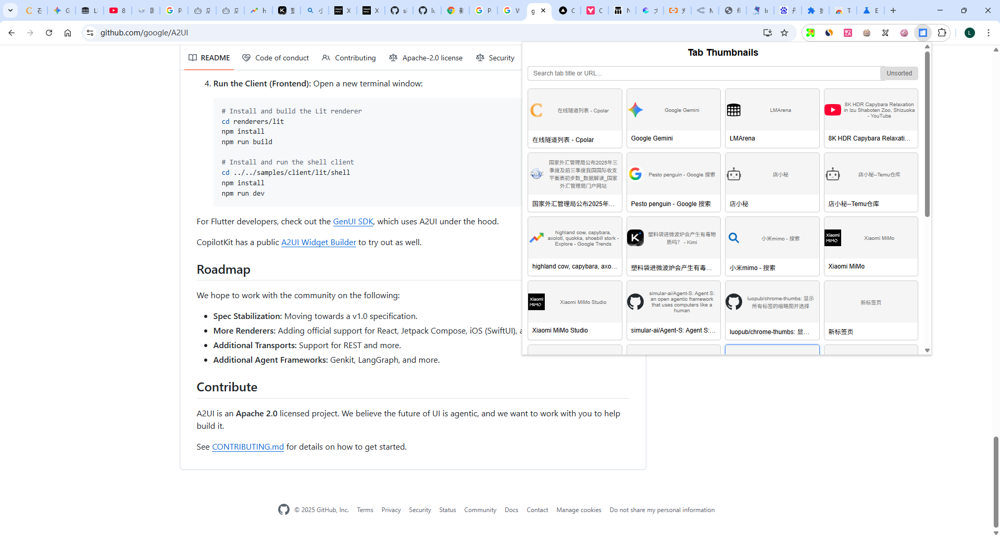
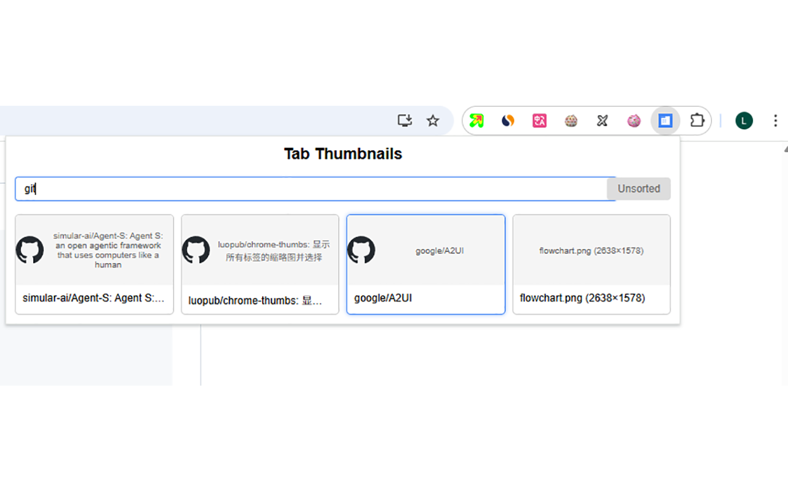
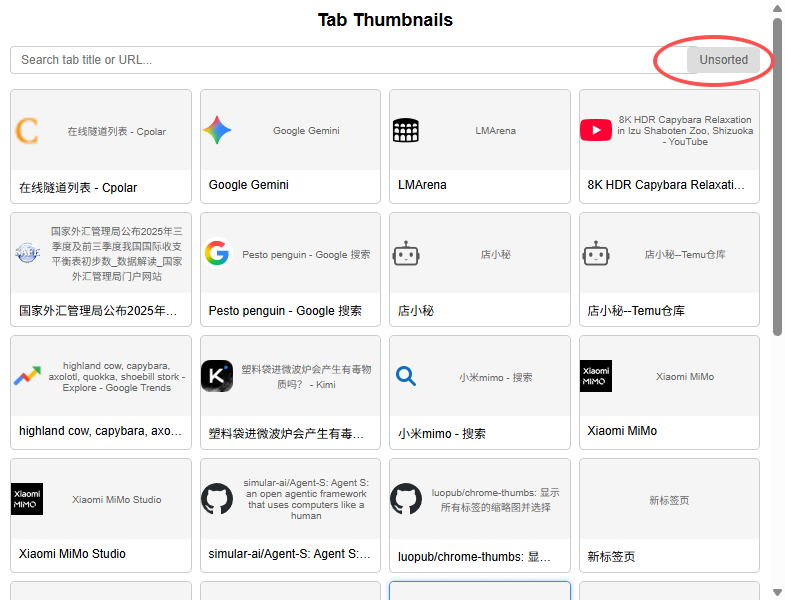
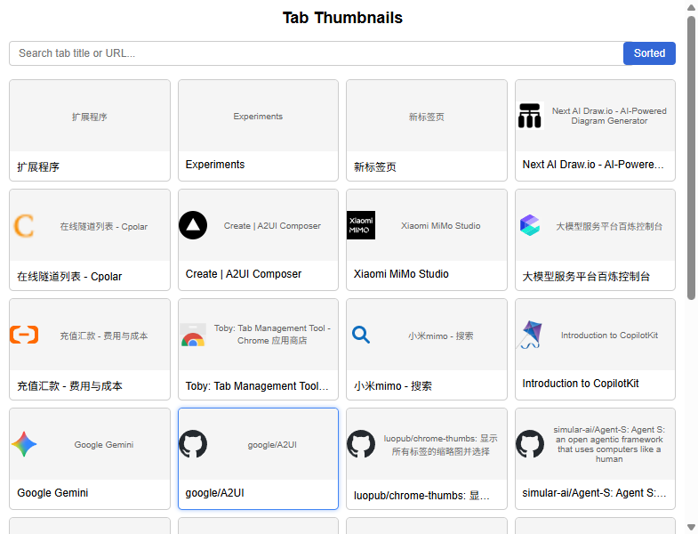
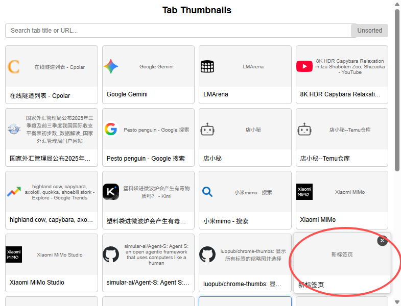

# Extensión de Miniaturas de Pestañas de Chrome

Una potente extensión del navegador Chrome, rica en funciones, que muestra miniaturas de todas las pestañas abiertas con capacidades avanzadas de navegación y gestión. ¡Aumenta tu productividad gestionando effortlessly múltiples pestañas del navegador con vistas previas visuales!

## Características

- **Visualización de Miniaturas de Pestañas**: Diseño de cuadrícula visual que muestra todas las pestañas abiertas del navegador
- **Navegación Rápida de Pestañas**: Haz clic en cualquier miniatura para cambiar instantáneamente a esa pestaña
- **Gestión Directa de Pestañas**: Cierra pestañas directamente desde la extensión con botones de cierre revelados al pasar el cursor
- **Retroalimentación Visual**: Resaltado de pestaña activa y efectos de desplazamiento suaves
- **Búsqueda Inteligente**: Filtrado en tiempo real de pestañas por título o URL
- **Ordenamiento Flexible**: Alterna entre disposiciones de pestañas ordenadas (por URL) y no ordenadas
- **Soporte Completo de Teclado**: Navega entre pestañas usando teclas de flecha y accesos directos de teclado
- **Persistencia de Estado**: Recuerda tus preferencias de ordenamiento entre sesiones del navegador
- **Diseño Responsivo**: Se adapta a diferentes números de pestañas abiertas
- **Características de Accesibilidad**: Navegación por teclado conforme a WCAG para todas las funciones

## Estadísticas

### Estrellas de GitHub

### Historial de Estrellas

## Palabras Clave
chrome-extension, tab-management, browser-extension, tab-thumbnails, productivity, chrome-tabs, tab-switcher, browser-tools

## Instalación

1. Abre el navegador Chrome y ve a la página de extensiones (chrome://extensions/)
2. Activa "Modo de desarrollador"
3. Haz clic en "Cargar descomprimida"
4. Selecciona esta carpeta (chrome-thumbs)
5. Si necesitas iconos, primero abre el archivo create-icons.html, descarga los iconos de todos los tamaños y guárdalos en la carpeta images

## Uso

### Uso Básico
1. Haz clic en el ícono de la extensión en la barra de herramientas del navegador
2. La ventana emergente mostrará miniaturas de todas las pestañas abiertas
3. Haz clic en cualquier miniatura para cambiar a la pestaña correspondiente

### Funciones Avanzadas

#### Buscar Pestañas
- Usa el cuadro de búsqueda en la parte superior para filtrar pestañas por título o URL
- Los resultados se actualizan en tiempo real mientras escribes

#### Ordenar Pestañas
- Haz clic en el botón "Ordenado/No ordenado" para alternar entre vistas ordenadas y no ordenadas
- El ordenamiento se hace alfabéticamente por URL
- Tu preferencia se guarda para futuras sesiones

#### Navegación por Teclado
- **Tab para enfocar**: Presiona la tecla Tab para navegar entre elementos
- **Navegación con flechas**: Usa las teclas de flecha (↑↓←→) para navegar entre miniaturas cuando están enfocadas
- **Enter**: Presiona Enter en una miniatura enfocada para cambiar a esa pestaña
- **Escape**: Presiona Escape para devolver el foco al cuadro de búsqueda
- **Enter en el cuadro de búsqueda**: Presiona Enter cuando el cuadro de búsqueda está enfocado para ir al primer resultado

#### Cerrar Pestañas
- Pasa el cursor sobre cualquier miniatura de pestaña para revelar el botón de cerrar (×)
- Haz clic en el botón de cerrar para cerrar la pestaña correspondiente
- La lista de pestañas se actualiza automáticamente después de cerrar

## Estructura de Archivos

- `manifest.json` - Archivo de configuración de la extensión con permisos y ajustes
- `popup.html` - Estructura HTML y estilo CSS de la ventana emergente
- `popup.js` - Lógica JavaScript para gestión de pestañas, búsqueda, ordenamiento y navegación
- `create-icons.html` - Herramienta de generación de iconos para crear iconos de la extensión
- `images/` - Carpeta que contiene archivos de iconos de la extensión (16px, 32px, 48px, 128px)
- `push-git.bat` - Script de despliegue de Git

## Detalles Técnicos

- **Permisos Requeridos**: tabs, activeTab, storage
- **API de Almacenamiento**: Utilizada para persistir las preferencias del usuario (estado de ordenamiento)
- **Diseño Responsivo**: El diseño de cuadrícula se adapta a diferentes números de pestañas
- **Accesibilidad**: Soporte completo de navegación por teclado para todas las funciones

## Notas

- Si no se pueden obtener las miniaturas, se mostrará el favicon del sitio web como alternativa
- La extensión utiliza la API de pestañas de Chrome para todas las operaciones de pestañas
- La búsqueda y filtrado funcionan en todas las pestañas abiertas en todas las ventanas
- La preferencia de ordenamiento se mantiene entre sesiones del navegador usando la API de almacenamiento de Chrome

## Demo/Capturas de Pantalla

Las siguientes capturas de pantalla muestran la funcionalidad clave de la extensión:

### Vista Principal de Miniaturas

Muestra todas las pestañas abiertas en un diseño de cuadrícula responsivo con vistas previas visuales y botones de cerrar.

### Funcionalidad de Búsqueda

Filtrado en tiempo real de pestañas por título o URL para acceso rápido a pestañas específicas.

### Vistas Ordenadas vs No Ordenadas

Alterna entre disposiciones de pestañas ordenadas (por URL) y no ordenadas para organizar tu espacio de trabajo.

### Navegación por Teclado

Indicadores visuales y accesos directos de teclado para una navegación eficiente de pestañas sin ratón.

### Gestión de Pestañas

Funciones avanzadas de gestión de pestañas incluyendo cierre rápido y cambio entre pestañas.

## Información del Proyecto

- **Creado**: 2025-12-19
- **Última Modificación**: 2025-12-19
- **Mantenedor**: [luopub](https://github.com/luopub)

## Instalación

### Desde Chrome Web Store (Recomendado)

1. Visita la [Chrome Web Store](https://chrome.google.com/webstore/detail/tab-thumbnails-visual-tab-manager/chrome-thumbs)
2. Haz clic en "Añadir a Chrome"
3. Otorga los permisos necesarios
4. Haz clic en el ícono de la extensión en tu barra de herramientas para comenzar a usar

### Instalación Manual (Para Desarrolladores)

1. Clona este repositorio: `git clone https://github.com/luopub/chrome-thumbs.git`
2. Abre el navegador Chrome y ve a la página de extensiones (chrome://extensions/)
3. Activa "Modo de desarrollador"
4. Haz clic en "Cargar descomprimida"
5. Selecciona esta carpeta (chrome-thumbs)
6. Si necesitas iconos, primero abre el archivo create-icons.html, descarga los iconos de todos los tamaños y guárdalos en la carpeta images

## Contribuir

¡Las contribuciones, problemas y solicitudes de características son bienvenidas! No dudes en revisar la [página de problemas](https://github.com/luopub/chrome-thumbs/issues) si quieres contribuir.

## Licencia

Este proyecto está licenciado bajo la Licencia MIT - consulta el archivo [LICENSE](LICENSE) para más detalles.

## Soporte

Si encuentras útil esta extensión, ¡por favor considera darle una ⭐ estrella en GitHub!

## Temas

- chrome-extension
- tab-management
- browser-extension
- productivity
- tab-thumbnails
- tab-switcher
- browser-tools
- chrome
- tabs
- extension-development